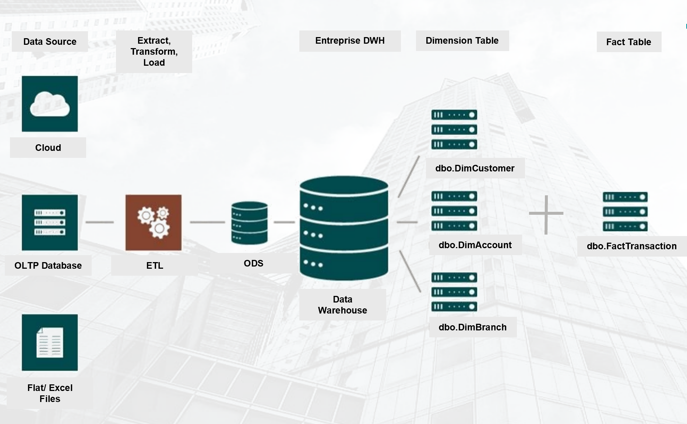
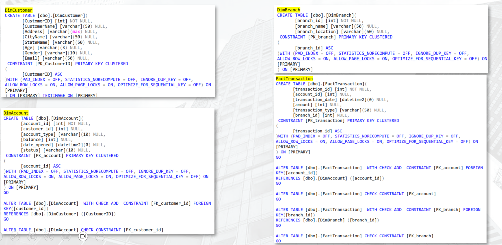
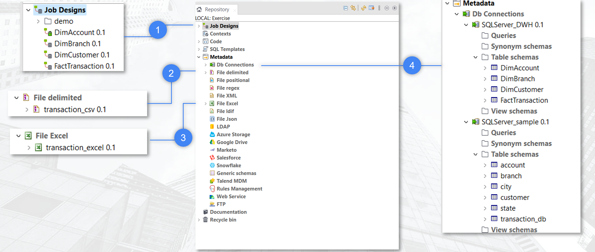
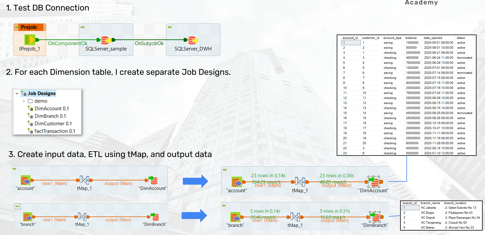
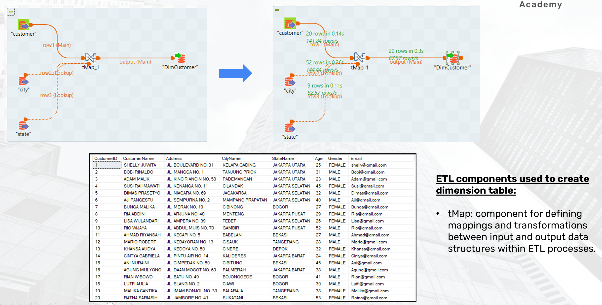
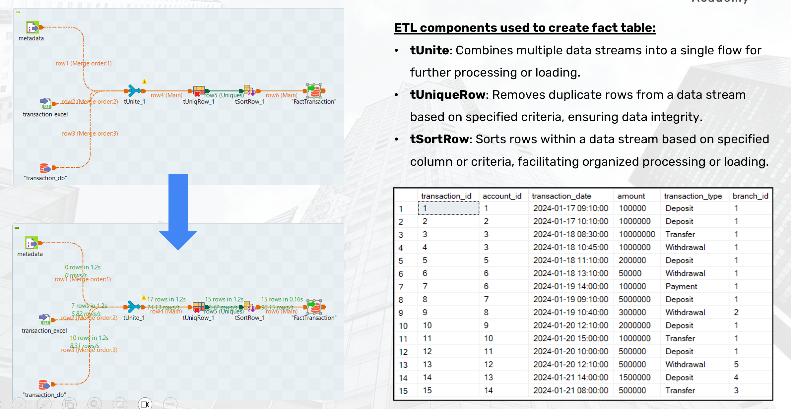
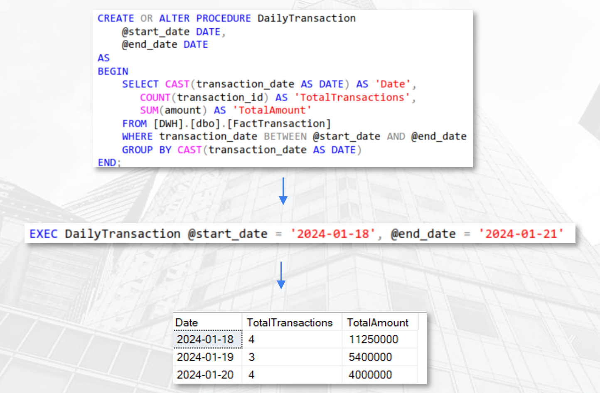
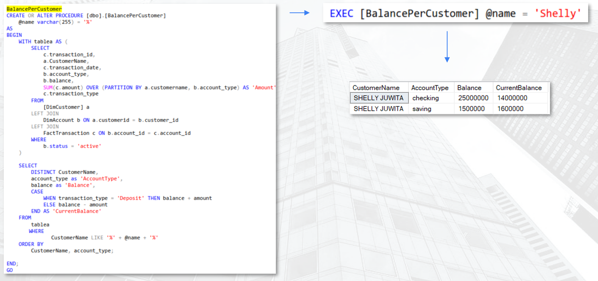

# Create Data Warehouse and Store Procedure
### ID/X Partners 

> “Without data you’re just another person with an opinion.” – W. Edwards Deming

## About Company
Established in 2002, ID/X Partners (PT IDX Consulting) has been catering to businesses across Asia and Australia, spanning diverse sectors including financial services, telecommunications, manufacturing, and retail. Specializing in Data Analytic and Decisioning (DAD) solutions, complemented by risk management and integrated marketing expertise, ID/X Partners assists clients in optimizing portfolio profitability and streamlining business processes. With its comprehensive consulting services and technological solutions, ID/X Partners stands out as a one-stop service provider.

## Background
One of the clients of ID/X Partners operating in the banking industry has a need to establish a Data Warehouse from multiple data sources stored within their systems.

## Available Data
The various data sources include:
- transaction_excel (Excel file)
- transaction_csv (CSV file)
- transaction_db (SQL Server Database)
- account (SQL Server Database)
- customer (SQL Server Database)
- branch (SQL Server Database)
- city (SQL Server Database)
- state (SQL Server Database)

## Problem Statement
The current challenge they face is difficulty in extracting data from various sources (Excel, CSV, databases) simultaneously, resulting in delays in their data reporting and analysis processes.

**Workflow Content**
- [1. Data Warehouse Creation](#1-data-warehouse-creation)
- [2. Create ETL Job for Dimension Table](#2-create-etl-job-for-dimension-table)
- [3. Create ETL Job for Fact Table](#3-create-etl-job-for-fact-table)
- [4. Create Store Procedure](#4-create-store-procedure)

-------------------------------------------------------------

### 1. Data Warehouse Creation
Data warehouse consolidates information from several sources into a single comprehensive database. By aggregating all of this data in one location, the company may conduct a more comprehensive analysis of its customers. Assessing data collected from many diverse sources might give insight into a company's performance

Work Step: Create 3 dimension tables and 1 fact tables

### 2. Create ETL Job for Dimension Table

Explanations:
* 1 – **Job Designs:** data integration workflows created using Talend Studio, defining the flow of data processing tasks.

* 2 – **DB Connections:** store and manage relational database connections centrally, enabling reuse across multiple jobs for consistency.
* 3 – **File Delimited:** settings for delimited files (e.g., CSV) in the repository, streamlining file handling in Talend jobs.
* 4 – **File Excel:** store metadata settings for Excel files in the repository, simplifying integration of Excel data into Talend jobs.

Work Step:

### 3. Create ETL Job for Fact Table

### 4. Create Store Procedure

There are 2 SP created:
- **DailyTransaction:** to calculate the number of transactions along with their total amounts for each day.

- **BalancePerCustomer:** calculate the remaining balance per customer.

<!-- <a class="top-link hide" href="#top">↑</a>

<a href="#top">Back to top</a> -->